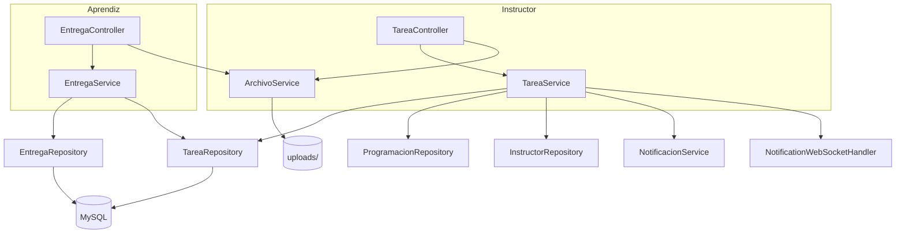

# Diseño Técnico: Gestión de Tareas

## Visión General

La funcionalidad de Gestión de Tareas permite a los instructores crear actividades académicas para sus fichas y a los aprendices entregar sus trabajos y recibir calificaciones. El diseño se integra con las entidades, repositorios, WebSocket y configuración de almacenamiento de archivos ya existentes en el proyecto SIA.

El flujo principal es:
1. El instructor crea una tarea para una ficha → se notifica a los aprendices vía WebSocket.
2. El aprendiz ve la tarea, sube su entrega antes de la fecha límite.
3. El instructor revisa las entregas y asigna calificaciones.

---

## Arquitectura



**Decisiones de diseño:**

- Los controladores siguen el patrón existente: sesión HTTP para autenticación, `Model` para vistas Thymeleaf.
- `ArchivoService` es un servicio transversal usado tanto por `TareaService` como por `EntregaService`, encapsulando toda la lógica de I/O de disco.
- La notificación al crear una tarea reutiliza `NotificationWebSocketHandler.notificarAprendicesDeFicha()` ya implementado.
- Se persiste una `Notificacion` por aprendiz destinatario para que los usuarios sin conexión activa la vean al iniciar sesión (Requisito 6.3).
- El almacenamiento de archivos usa UUID como nombre para evitar colisiones, preservando la extensión original (Requisito 7.4).

---

## Componentes e Interfaces

### Controladores

**TareaController** (`/instructor/tareas`)
| Método | Ruta | Descripción |
|--------|------|-------------|
| GET | `/instructor/tareas` | Lista tareas del instructor autenticado |
| GET | `/instructor/tareas/nueva` | Formulario de creación |
| POST | `/instructor/tareas/nueva` | Guarda nueva tarea |
| GET | `/instructor/tareas/{id}/entregas` | Panel de entregas de una tarea |
| POST | `/instructor/tareas/{id}/calificar/{idEntrega}` | Guarda calificación |

**EntregaController** (`/aprendiz/tareas`)
| Método | Ruta | Descripción |
|--------|------|-------------|
| GET | `/aprendiz/tareas` | Lista tareas de la ficha del aprendiz |
| GET | `/aprendiz/tareas/{id}` | Detalle de tarea + formulario de entrega |
| POST | `/aprendiz/tareas/{id}/entregar` | Sube entrega |

### Servicios

**TareaService**
```java
List<Tarea> listarPorInstructor(Integer idInstructor);
List<String> obtenerFichasDeInstructor(Integer idInstructor);
Tarea crearTarea(TareaRequest request, Integer idInstructor, MultipartFile archivo);
List<EntregaResumenDTO> listarEntregasDeTarea(Long idTarea, Integer idInstructor);
void calificar(Long idEntrega, Double nota, String comentario, Integer idInstructor);
```

**EntregaService**
```java
List<TareaAprendizDTO> listarTareasParaAprendiz(String fichaFormacion, Integer idAprendiz);
EntregaTarea entregar(Long idTarea, Integer idAprendiz, MultipartFile archivo);
```

**ArchivoService**
```java
String guardarArchivoTarea(Long idTarea, MultipartFile archivo);
String guardarArchivoEntrega(Long idTarea, Integer idAprendiz, MultipartFile archivo);
void eliminarArchivo(String rutaRelativa);
void validarArchivo(MultipartFile archivo, long maxBytes);
```

### Vistas Thymeleaf

| Plantilla | Descripción |
|-----------|-------------|
| `instructor/tareas/lista.html` | Lista de tareas del instructor con acceso a entregas |
| `instructor/tareas/nueva.html` | Formulario de creación de tarea |
| `instructor/tareas/entregas.html` | Panel de entregas con formulario de calificación |
| `aprendiz/tareas/lista.html` | Lista de tareas de la ficha del aprendiz |
| `aprendiz/tareas/detalle.html` | Detalle de tarea con formulario de entrega |

---

## Modelos de Datos

### Entidad `Tarea`

```java
@Entity
@Table(name = "tarea")
public class Tarea {
    @Id @GeneratedValue(strategy = GenerationType.IDENTITY)
    private Long id;

    @Column(nullable = false, length = 200)
    private String titulo;

    @Column(columnDefinition = "TEXT")
    private String descripcion;

    @Column(nullable = false)
    private LocalDateTime fechaLimite;

    @Column(nullable = false)
    private String nombreFicha; // ficha destino

    @ManyToOne(optional = false)
    @JoinColumn(name = "id_instructor")
    private Instructor instructor;

    private String rutaArchivo; // ruta relativa en uploads/tareas/{id}/

    @Column(nullable = false)
    private LocalDateTime fechaCreacion = LocalDateTime.now();
}
```

### Entidad `EntregaTarea`

```java
@Entity
@Table(name = "entrega_tarea",
       uniqueConstraints = @UniqueConstraint(columnNames = {"id_tarea", "id_aprendiz"}))
public class EntregaTarea {
    @Id @GeneratedValue(strategy = GenerationType.IDENTITY)
    private Long id;

    @ManyToOne(optional = false)
    @JoinColumn(name = "id_tarea")
    private Tarea tarea;

    @ManyToOne(optional = false)
    @JoinColumn(name = "id_aprendiz")
    private Aprendiz aprendiz;

    @Column(nullable = false)
    private String rutaArchivo; // uploads/entregas/{idTarea}/{idAprendiz}/

    @Column(nullable = false)
    private LocalDateTime fechaEntrega;

    // Calificación (null = sin calificar)
    private Double nota; // 0.0 – 5.0

    @Column(columnDefinition = "TEXT")
    private String comentarioInstructor;

    private LocalDateTime fechaCalificacion;
}
```

### DTOs

**TareaRequest** (formulario de creación)
```java
public class TareaRequest {
    @NotBlank @Size(max = 200)
    private String titulo;
    private String descripcion;
    @NotNull
    private LocalDateTime fechaLimite;
    @NotBlank
    private String nombreFicha;
}
```

**TareaAprendizDTO** (vista aprendiz)
```java
public class TareaAprendizDTO {
    private Long idTarea;
    private String titulo;
    private String descripcion;
    private String nombreInstructor;
    private LocalDateTime fechaLimite;
    private String estadoEntrega; // "PENDIENTE", "ENTREGADA", "CALIFICADA", "VENCIDA"
    private Double nota;
    private String comentarioInstructor;
    private boolean tieneArchivoTarea;
}
```

**EntregaResumenDTO** (vista instructor)
```java
public class EntregaResumenDTO {
    private Integer idAprendiz;
    private String nombreAprendiz;
    private String estadoEntrega; // "ENTREGADO", "PENDIENTE"
    private LocalDateTime fechaEntrega;
    private Long idEntrega;
    private String rutaArchivo;
    private Double nota;
    private String comentario;
}
```

### Repositorios

**TareaRepository**
```java
public interface TareaRepository extends JpaRepository<Tarea, Long> {
    List<Tarea> findByNombreFicha(String nombreFicha);
    List<Tarea> findByInstructor_Id(Integer idInstructor);
    List<Tarea> findByNombreFichaAndInstructor_Id(String nombreFicha, Integer idInstructor);
}
```

**EntregaTareaRepository**
```java
public interface EntregaTareaRepository extends JpaRepository<EntregaTarea, Long> {
    Optional<EntregaTarea> findByTarea_IdAndAprendiz_IdAprendiz(Long idTarea, Integer idAprendiz);
    List<EntregaTarea> findByTarea_Id(Long idTarea);
}
```

**ProgramacionRepository** (query adicional necesaria)
```java
// Método a agregar al repositorio existente:
@Query("SELECT DISTINCT p.nombreFicha FROM Programacion p WHERE p.instructor.id = :idInstructor")
List<String> findFichasByInstructorId(@Param("idInstructor") Integer idInstructor);
```

---

## Propiedades de Corrección

*Una propiedad es una característica o comportamiento que debe mantenerse verdadero en todas las ejecuciones válidas de un sistema — esencialmente, un enunciado formal sobre lo que el sistema debe hacer. Las propiedades sirven como puente entre las especificaciones legibles por humanos y las garantías de corrección verificables por máquina.*

### Propiedad 1: Solo fichas del instructor autenticado

*Para cualquier* instructor autenticado, la lista de fichas disponibles al crear una tarea debe contener únicamente fichas donde ese instructor aparece como responsable en `Programacion`, y ninguna ficha de otro instructor.

**Valida: Requisito 1.1**

---

### Propiedad 2: Validación de campos obligatorios de tarea

*Para cualquier* intento de guardar una tarea donde el título esté vacío o la fecha límite sea nula, el sistema debe rechazar la operación y el número de tareas persistidas no debe aumentar.

**Valida: Requisitos 2.1, 2.2, 2.5**

---

### Propiedad 3: Validación de archivos adjuntos

*Para cualquier* archivo cuya extensión no esté en {PDF, DOCX, XLSX, PNG, JPG} o cuyo tamaño supere el límite configurado, el sistema debe rechazarlo y no persistir ningún registro asociado.

**Valida: Requisitos 2.3, 4.1, 4.5**

---

### Propiedad 4: Aislamiento de tareas por ficha

*Para cualquier* aprendiz autenticado, la lista de tareas que ve debe contener únicamente tareas cuyo `nombreFicha` coincida exactamente con el `fichaFormacion` del aprendiz, y ninguna tarea de otra ficha.

**Valida: Requisito 3.1**

---

### Propiedad 5: Estado de tarea coherente con fecha límite

*Para cualquier* tarea y cualquier aprendiz sin entrega, si la fecha actual es anterior a `fechaLimite` el estado debe ser "PENDIENTE" (activa); si la fecha actual es posterior a `fechaLimite` el estado debe ser "VENCIDA".

**Valida: Requisitos 3.3, 3.4**

---

### Propiedad 6: Entrega reemplaza la anterior dentro del plazo

*Para cualquier* aprendiz que ya tiene una entrega para una tarea activa, al subir un nuevo archivo la entrega anterior debe ser reemplazada, de modo que solo exista una entrega por par (tarea, aprendiz) en la base de datos.

**Valida: Requisito 4.3**

---

### Propiedad 7: Rechazo de entrega fuera de plazo

*Para cualquier* intento de entrega donde la fecha actual sea posterior a `fechaLimite`, el sistema debe rechazar la operación y el número de entregas persistidas no debe aumentar.

**Valida: Requisito 4.4**

---

### Propiedad 8: Calificación dentro del rango válido

*Para cualquier* calificación con valor fuera del intervalo [0.0, 5.0], el sistema debe rechazar la operación y la entrega debe conservar su nota anterior (o null si no tenía).

**Valida: Requisitos 5.3, 5.4**

---

### Propiedad 9: Notificación a todos los aprendices de la ficha

*Para cualquier* tarea creada para una ficha, el número de notificaciones persistidas en `Notificacion` debe ser igual al número de aprendices cuyo `fichaFormacion` coincide con la ficha de la tarea.

**Valida: Requisitos 6.1, 6.2**

---

### Propiedad 10: Round-trip de almacenamiento de archivos

*Para cualquier* archivo válido guardado mediante `ArchivoService`, la ruta retornada debe apuntar a un archivo existente en disco con el mismo contenido binario que el original.

**Valida: Requisitos 7.1, 7.2, 7.4**

---

### Propiedad 11: Atomicidad archivo-base de datos

*Para cualquier* operación de guardado donde el I/O de disco falle, no debe existir ningún registro nuevo en la tabla correspondiente (`tarea` o `entrega_tarea`).

**Valida: Requisito 7.3**

---

## Manejo de Errores

| Escenario | Comportamiento |
|-----------|---------------|
| Instructor sin fichas en `Programacion` | Formulario deshabilitado con mensaje informativo (Req 1.3) |
| Campo obligatorio vacío al crear tarea | Redirección al formulario con mensaje de error, datos preservados (Req 2.5) |
| Archivo con extensión no permitida | Mensaje de error descriptivo, operación cancelada (Req 2.3, 4.5) |
| Archivo supera tamaño máximo | Mensaje de error descriptivo, operación cancelada (Req 4.5) |
| Entrega después de fecha límite | HTTP 400 con mensaje "El plazo de entrega ha vencido" (Req 4.4) |
| Calificación fuera de rango [0.0, 5.0] | HTTP 400 con mensaje de validación (Req 5.4) |
| Error de I/O al guardar archivo | Rollback de transacción JPA + mensaje de error al usuario (Req 7.3) |
| Sesión expirada | Redirección a `/login` |

**Estrategia de rollback para archivos:**
`ArchivoService.guardarArchivoTarea()` y `guardarArchivoEntrega()` escriben el archivo en disco antes de retornar la ruta. Si la transacción JPA falla después, el servicio que llama es responsable de invocar `eliminarArchivo()` en el bloque `catch`. Esto garantiza consistencia sin necesidad de un gestor de transacciones distribuidas.

---

## Estrategia de Pruebas

### Pruebas Unitarias

Cubren casos concretos y condiciones de borde:

- `ArchivoService`: extensiones permitidas/rechazadas, tamaño límite exacto, nombre UUID generado correctamente.
- `TareaService.crearTarea()`: título vacío rechazado, fecha límite nula rechazada, tarea válida persistida.
- `EntregaService.entregar()`: entrega fuera de plazo rechazada, reemplazo de entrega existente.
- `EntregaService` calificación: nota 0.0 aceptada, nota 5.0 aceptada, nota 5.1 rechazada, nota -0.1 rechazada.
- Cálculo de estado de tarea: PENDIENTE, VENCIDA, ENTREGADA, CALIFICADA.

### Pruebas Basadas en Propiedades

Se usa **jqwik** (disponible en el ecosistema JUnit 5 / Spring Boot Test) con mínimo 100 iteraciones por propiedad.

Cada prueba de propiedad referencia su propiedad de diseño con el tag:
`Feature: gestion-tareas, Property N: <texto>`

| Propiedad | Descripción del test |
|-----------|---------------------|
| P1 | Generar instructores aleatorios con fichas aleatorias; verificar que `obtenerFichasDeInstructor` nunca retorna fichas de otro instructor |
| P2 | Generar `TareaRequest` con título vacío o nulo; verificar que `crearTarea` lanza excepción y el conteo de tareas no cambia |
| P3 | Generar archivos con extensiones y tamaños aleatorios; verificar que `validarArchivo` acepta solo los permitidos |
| P4 | Generar aprendices con fichas aleatorias y tareas en múltiples fichas; verificar que `listarTareasParaAprendiz` retorna solo las de su ficha |
| P5 | Generar tareas con `fechaLimite` aleatoria y aprendices sin entrega; verificar coherencia del estado calculado |
| P6 | Generar aprendiz con entrega existente + nuevo archivo válido dentro del plazo; verificar que solo existe una entrega por (tarea, aprendiz) |
| P7 | Generar intentos de entrega con fecha actual posterior a `fechaLimite`; verificar rechazo y conteo invariante |
| P8 | Generar valores de nota fuera de [0.0, 5.0]; verificar rechazo y que la nota almacenada no cambia |
| P9 | Generar tareas para fichas con N aprendices aleatorios; verificar que se crean exactamente N notificaciones |
| P10 | Generar archivos válidos aleatorios; verificar que la ruta retornada existe en disco y el contenido coincide |
| P11 | Simular fallo de I/O en `ArchivoService`; verificar que no se persiste ningún registro en BD |

**Configuración de jqwik** (agregar a `pom.xml`):
```xml
<dependency>
    <groupId>net.jqwik</groupId>
    <artifactId>jqwik</artifactId>
    <version>1.8.1</version>
    <scope>test</scope>
</dependency>
```
