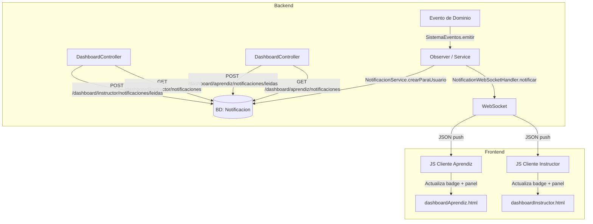
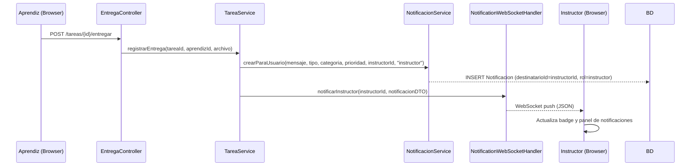

# Documento de Diseño: Notificaciones en Dashboards de Instructor y Aprendiz

## Visión General

Este documento describe el diseño para integrar el sistema de notificaciones en tiempo real en los dashboards del instructor y del aprendiz del SIA. La infraestructura base ya existe (entidad `Notificacion`, `NotificacionService`, `NotificationWebSocketHandler`, WebSocket configurado); el objetivo es extenderla para que ambos roles reciban y visualicen notificaciones contextuales en sus paneles, con soporte para persistencia por usuario, conteo de no leídas y despacho desde eventos del dominio (entrega de tareas, inasistencias, incapacidades).

La entidad `Notificacion` actual es global (sin destinatario). Para soportar notificaciones por usuario se requiere agregar un campo `destinatarioId` (idUsuario) y un campo `rol` (`aprendiz` | `instructor`), o bien crear una tabla de asociación. Este diseño opta por la solución más simple: agregar los campos directamente a la entidad existente.

---

## Arquitectura



---

## Diagramas de Secuencia

### Flujo: Aprendiz entrega tarea → Instructor recibe notificación



### Flujo: Instructor registra inasistencia → Aprendiz recibe notificación

```mermaid
sequenceDiagram
    participant IN as Instructor (Browser)
    participant AC as AsistenciaController
    participant NS as NotificacionService
    participant WS as NotificationWebSocketHandler
    participant AP as Aprendiz (Browser)

    IN->>AC: POST /asistencia/registrar
    AC->>NS: crearParaUsuario(mensaje, "inasistencia", "asistencia", "alta", aprendizId, "aprendi