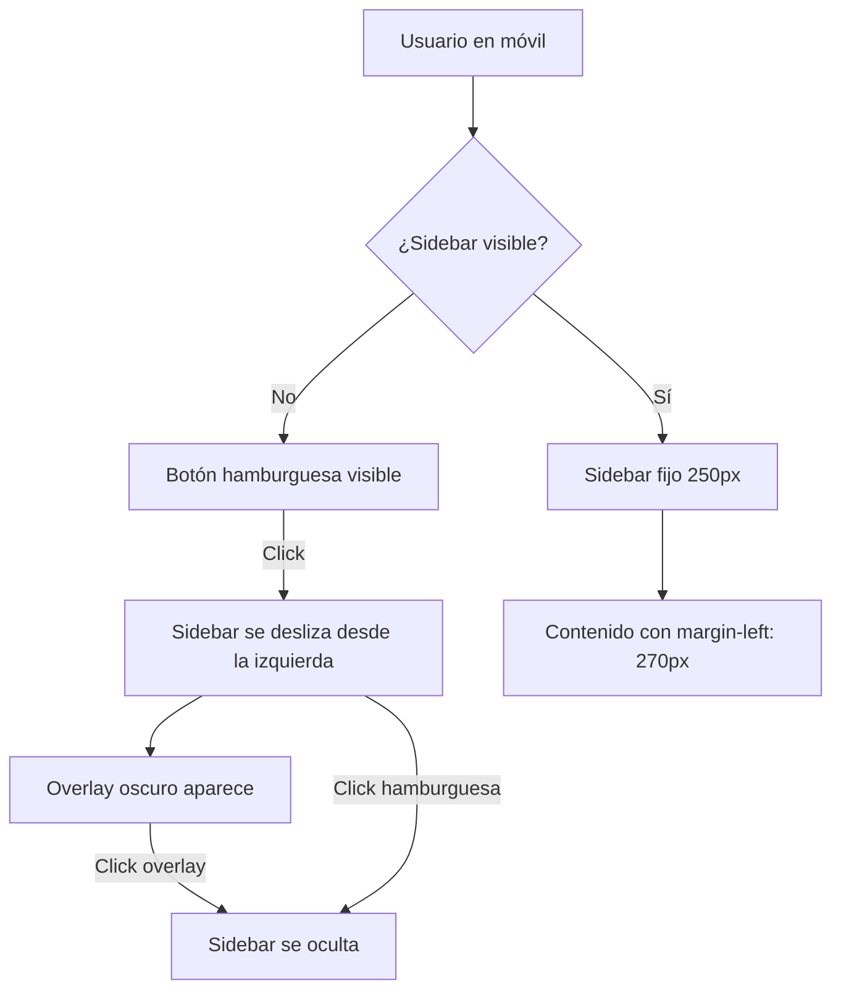
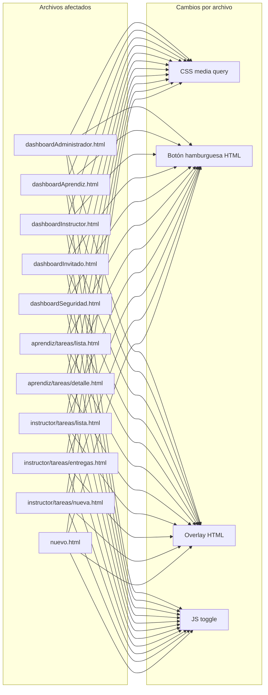
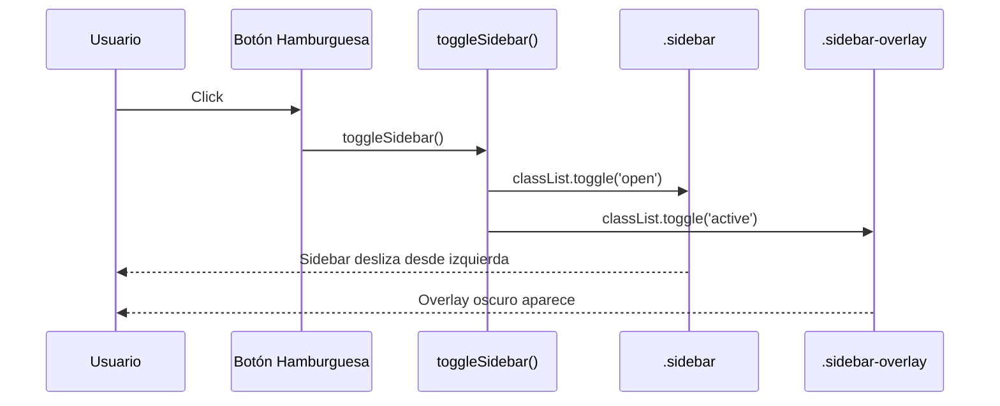
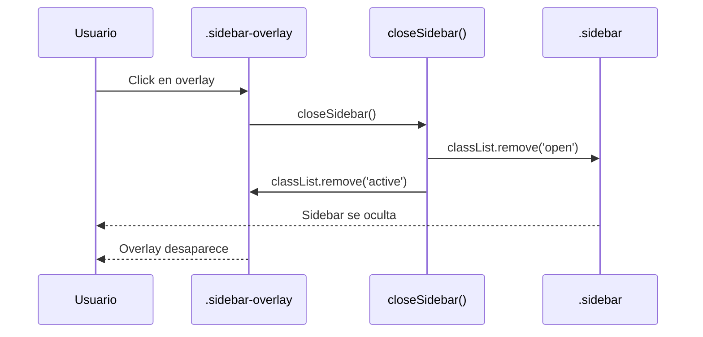

# Design Document: responsive-sidebar-mobile

## Overview

Hacer responsive todos los dashboards y páginas del proyecto SIA (Spring Boot + Thymeleaf) sin modificar el diseño de escritorio. En móvil (≤768px) el sidebar queda oculto por defecto y se muestra/oculta mediante un botón hamburguesa, con un overlay oscuro de fondo. El contenido ocupa el 100% del ancho en móvil.

El proyecto tiene 11 archivos HTML con estilos inline que comparten el mismo patrón de layout. La solución se aplica de forma uniforme a todos ellos.

## Architecture





## Components and Interfaces

### Componente 1: Botón Hamburguesa

**Purpose**: Botón fijo en la esquina superior izquierda, visible solo en móvil. Abre/cierra el sidebar.

**HTML**:
```html
<button class="hamburger-btn" id="hamburgerBtn" onclick="toggleSidebar()" aria-label="Abrir menú">
  &#9776;
</button>
```

**Responsabilidades**:
- Visible solo en `max-width: 768px`
- Posición `fixed`, `top: 12px`, `left: 12px`, `z-index: 200`
- Muestra el ícono ☰ (hamburguesa)

### Componente 2: Overlay

**Purpose**: Capa semitransparente oscura que cubre el contenido cuando el sidebar está abierto en móvil. Al hacer clic cierra el sidebar.

**HTML**:
```html
<div class="sidebar-overlay" id="sidebarOverlay" onclick="closeSidebar()"></div>
```

**Responsabilidades**:
- `display: none` por defecto
- Cuando activo: `position: fixed`, cubre toda la pantalla, `background: rgba(0,0,0,0.5)`, `z-index: 150`
- Se activa junto con la apertura del sidebar

### Componente 3: CSS Media Query

**Purpose**: Reglas CSS que modifican el comportamiento del sidebar y el contenido en pantallas ≤768px.

**Reglas**:
```css
@media (max-width: 768px) {
  .hamburger-btn {
    display: block;
  }
  .sidebar {
    transform: translateX(-100%);
    transition: transform 0.3s ease;
    z-index: 160;
  }
  .sidebar.open {
    transform: translateX(0);
  }
  .sidebar-overlay.active {
    display: block;
  }
  /* clase content puede ser .content o .main-content según el archivo */
  .content, .main-content {
    margin-left: 0;
    padding: 60px 15px 15px;
  }
}
```

**Nota sobre `dashboardAdministrador.html`**: Ya tiene un media query parcial en `@media (max-width: 720px)` que oculta el sidebar con `display: none`. Ese bloque se reemplaza con la solución unificada a 768px.

### Componente 4: JavaScript Toggle

**Purpose**: Funciones JS para abrir/cerrar el sidebar y el overlay.

```javascript
function toggleSidebar() {
  const sidebar = document.querySelector('.sidebar');
  const overlay = document.getElementById('sidebarOverlay');
  sidebar.classList.toggle('open');
  overlay.classList.toggle('active');
}

function closeSidebar() {
  const sidebar = document.querySelector('.sidebar');
  const overlay = document.getElementById('sidebarOverlay');
  sidebar.classList.remove('open');
  overlay.classList.remove('active');
}
```

## Data Models

No aplica — esta feature es puramente de presentación (CSS/HTML/JS). No hay modelos de datos ni cambios en el backend.

## Sequence Diagrams

### Flujo: Abrir sidebar en móvil



### Flujo: Cerrar sidebar en móvil



## Key Functions with Formal Specifications

### toggleSidebar()

**Preconditions**:
- Existe un elemento `.sidebar` en el DOM
- Existe un elemento `#sidebarOverlay` en el DOM

**Postconditions**:
- Si `.sidebar` no tenía clase `open` → la adquiere; overlay adquiere clase `active`
- Si `.sidebar` tenía clase `open` → la pierde; overlay pierde clase `active`
- El estado de escritorio (>768px) no se ve afectado

### closeSidebar()

**Preconditions**:
- Existe un elemento `.sidebar` en el DOM
- Existe un elemento `#sidebarOverlay` en el DOM

**Postconditions**:
- `.sidebar` no tiene clase `open`
- `#sidebarOverlay` no tiene clase `active`

## Algorithmic Pseudocode

### Algoritmo de aplicación por archivo

```pascal
PROCEDURE aplicarResponsiveSidebar(archivo)
  INPUT: archivo HTML con patrón sidebar/content
  OUTPUT: archivo modificado con soporte móvil

  SEQUENCE
    // 1. Agregar CSS al bloque <style>
    IF archivo tiene media query existente en max-width: 720px THEN
      REPLACE media query con versión unificada a 768px
    ELSE
      APPEND media query responsive al final del bloque <style>
    END IF

    // 2. Agregar botón hamburguesa
    INSERT <button class="hamburger-btn"> justo antes de <div class="sidebar"> o <aside class="sidebar">

    // 3. Agregar overlay
    INSERT <div class="sidebar-overlay"> justo después del cierre del sidebar

    // 4. Agregar JavaScript
    IF archivo ya tiene bloque <script> THEN
      APPEND funciones toggleSidebar() y closeSidebar() al bloque existente
    ELSE
      INSERT nuevo bloque <script> antes de </body>
    END IF
  END SEQUENCE
END PROCEDURE
```

### Variaciones por archivo

| Archivo | Clase contenido | Clase sidebar | Nota especial |
|---------|----------------|---------------|---------------|
| dashboardAdministrador.html | `.content` | `.sidebar` | Reemplazar media query existente (720px) |
| dashboardAprendiz.html | `.content` | `.sidebar` | Estándar |
| dashboardInstructor.html | `.content` | `.sidebar` | Estándar |
| dashboardInvitado.html | `.content` | `.sidebar` | Estándar |
| dashboardSeguridad.html | `.main-content` | `.sidebar` | Clase contenido diferente |
| aprendiz/tareas/lista.html | `.content` | `.sidebar` | Estándar |
| aprendiz/tareas/detalle.html | `.content` | `.sidebar` | Estándar |
| instructor/tareas/lista.html | `.content` | `.sidebar` | Estándar |
| instructor/tareas/entregas.html | `.content` | `.sidebar` | Estándar |
| instructor/tareas/nueva.html | `.content` | `.sidebar` | Estándar |
| nuevo.html | `.content` | `.sidebar` | Sidebar mínimo (solo 1 enlace) |

## CSS Completo a Agregar

### Bloque CSS base (para todos los archivos)

```css
/* ===== RESPONSIVE MOBILE ===== */
.hamburger-btn {
  display: none;
  position: fixed;
  top: 12px;
  left: 12px;
  z-index: 200;
  background: #006B2D;
  color: #fff;
  border: none;
  border-radius: 6px;
  width: 40px;
  height: 40px;
  font-size: 20px;
  cursor: pointer;
  line-height: 1;
}

.sidebar-overlay {
  display: none;
  position: fixed;
  top: 0; left: 0;
  width: 100%; height: 100%;
  background: rgba(0, 0, 0, 0.5);
  z-index: 150;
}

.sidebar-overlay.active {
  display: block;
}

@media (max-width: 768px) {
  .hamburger-btn {
    display: block;
  }

  .sidebar {
    transform: translateX(-100%);
    transition: transform 0.3s ease;
    z-index: 160;
  }

  .sidebar.open {
    transform: translateX(0);
  }

  .content, .main-content {
    margin-left: 0 !important;
    padding: 60px 15px 15px !important;
  }
}
```

### Variante para dashboardAdministrador.html

El media query existente `@media (max-width: 720px)` que contiene:
```css
.sidebar { display: none; }
.content { margin-left: 15px; padding: 15px; }
```
Se reemplaza completamente por el bloque CSS base anterior (con breakpoint 768px).

## HTML a Insertar

### Botón hamburguesa (antes del `<div class="sidebar">` o `<aside class="sidebar">`)

```html
<button class="hamburger-btn" id="hamburgerBtn" onclick="toggleSidebar()" aria-label="Abrir menú">&#9776;</button>
```

### Overlay (después del cierre del sidebar, antes del contenido principal)

```html
<div class="sidebar-overlay" id="sidebarOverlay" onclick="closeSidebar()"></div>
```

## JavaScript a Insertar

```javascript
function toggleSidebar() {
  document.querySelector('.sidebar').classList.toggle('open');
  document.getElementById('sidebarOverlay').classList.toggle('active');
}
function closeSidebar() {
  document.querySelector('.sidebar').classList.remove('open');
  document.getElementById('sidebarOverlay').classList.remove('active');
}
```

## Error Handling

### Escenario 1: Sidebar con `display: none` en escritorio

**Condición**: Algunos archivos podrían tener el sidebar oculto con `display: none` en lugar de `transform`.
**Respuesta**: El CSS usa `transform: translateX(-100%)` que no interfiere con `display`. Si el sidebar ya tiene `display: none` en algún estado, se mantiene ese comportamiento.

### Escenario 2: Múltiples elementos `.sidebar`

**Condición**: `document.querySelector('.sidebar')` solo selecciona el primero.
**Respuesta**: Ningún archivo tiene más de un sidebar, por lo que no hay conflicto.

### Escenario 3: `dashboardAdministrador` con media query existente

**Condición**: Ya tiene `@media (max-width: 720px)` con `display: none` en sidebar.
**Respuesta**: Se reemplaza ese bloque completo por el nuevo CSS unificado. El breakpoint cambia de 720px a 768px para consistencia.

### Escenario 4: `dashboardSeguridad` con clase `.main-content`

**Condición**: Usa `.main-content` en lugar de `.content` para el área principal.
**Respuesta**: El media query incluye ambas clases: `.content, .main-content { margin-left: 0 !important; }`.

## Testing Strategy

### Unit Testing Approach

No aplica testing unitario de backend (no hay cambios en Java/Spring).

### Pruebas manuales por archivo

Para cada uno de los 11 archivos:
1. Abrir en Chrome DevTools con viewport 375px (iPhone SE)
2. Verificar que el sidebar está oculto al cargar
3. Verificar que el botón hamburguesa es visible
4. Click en hamburguesa → sidebar aparece desde la izquierda + overlay oscuro
5. Click en overlay → sidebar se oculta
6. Click en hamburguesa nuevamente → sidebar se oculta
7. Cambiar viewport a 1024px → sidebar visible, botón hamburguesa oculto, layout de escritorio intacto

### Breakpoints a probar

| Viewport | Comportamiento esperado |
|----------|------------------------|
| 375px (móvil) | Sidebar oculto, hamburguesa visible, contenido 100% ancho |
| 768px (límite) | Sidebar oculto, hamburguesa visible |
| 769px (escritorio) | Sidebar visible, hamburguesa oculto, layout original |
| 1280px (escritorio) | Layout original sin cambios |

### Property-Based Testing Approach

No aplica para cambios puramente de CSS/HTML/JS de presentación.

## Performance Considerations

- La transición CSS `transform: translateX` usa compositing del GPU, no genera reflow.
- El overlay usa `display: none` / `display: block` (no `visibility` ni `opacity`) para evitar que elementos ocultos reciban eventos.
- No se agregan librerías externas; todo es CSS/JS vanilla.

## Security Considerations

- No hay cambios en el backend ni en la autenticación.
- El sidebar en móvil sigue siendo parte del DOM; los enlaces de navegación mantienen sus `th:href` de Thymeleaf y la protección de Spring Security.
- El botón hamburguesa no expone rutas ni datos sensibles.

## Dependencies

- Sin dependencias nuevas.
- Compatible con las librerías ya usadas: Font Awesome, Poppins, SweetAlert2, DataTables, Chart.js.
- Requiere navegadores con soporte CSS `transform` y `transition` (todos los navegadores modernos).


## Correctness Properties

*Una propiedad es una característica o comportamiento que debe cumplirse en todas las ejecuciones válidas del sistema — esencialmente, una afirmación formal sobre lo que el sistema debe hacer. Las propiedades sirven de puente entre las especificaciones legibles por humanos y las garantías de corrección verificables por máquina.*

### Property 1: Bloque CSS correcto en todos los archivos

*Para cualquier* archivo de los 11 Archivos_Afectados, el CSS generado debe contener: `transform: translateX(-100%)` para `.sidebar` dentro del media query, `margin-left: 0` para `.content` y `.main-content` dentro del media query, `display: none` para `.hamburger-btn` fuera del media query, `display: block` para `.hamburger-btn` dentro del media query, `transform: translateX(0)` para `.sidebar.open`, `transition: transform 0.3s ease` para `.sidebar`, y `display: block` para `.sidebar-overlay.active`.

**Validates: Requirements 1.1, 1.2, 2.1, 2.2, 3.2, 3.3, 8.1, 8.2**

### Property 2: Toggle del sidebar es una involución

*Para cualquier* estado inicial del sidebar (con o sin clase `open`), llamar a `toggleSidebar()` dos veces consecutivas debe devolver el sidebar y el overlay exactamente al estado inicial.

**Validates: Requirements 3.1, 4.2**

### Property 3: closeSidebar() es idempotente

*Para cualquier* estado inicial del sidebar, llamar a `closeSidebar()` una o más veces debe resultar siempre en que el sidebar no tenga la clase `open` y el overlay no tenga la clase `active`.

**Validates: Requirements 4.3**

### Property 4: Los cuatro componentes están presentes en todos los archivos

*Para cualquier* archivo de los 11 Archivos_Afectados, el HTML resultante debe contener: (a) el bloque CSS responsive, (b) el elemento `<button class="hamburger-btn">` con `aria-label` antes del sidebar, (c) el elemento `<div class="sidebar-overlay">` después del cierre del sidebar, y (d) las funciones `toggleSidebar()` y `closeSidebar()` en un bloque `<script>`.

**Validates: Requirements 2.3, 5.1, 5.2, 5.3, 5.4**

### Property 5: No-regresión del layout de escritorio

*Para cualquier* archivo de los 11 Archivos_Afectados, los estilos aplicados fuera del bloque `@media (max-width: 768px)` no deben modificar el `margin-left` del área de contenido ni el ancho o visibilidad del sidebar respecto al diseño original.

**Validates: Requirements 1.3, 7.1, 7.2**

### Property 6: Sin dependencias externas nuevas

*Para cualquier* archivo de los 11 Archivos_Afectados, el HTML resultante no debe contener etiquetas `<script src="...">` ni `<link rel="stylesheet" href="...">` que no estuvieran presentes en el archivo original.

**Validates: Requirements 8.3**
